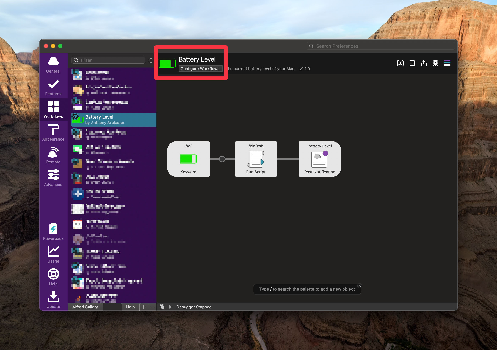

# Battery Level

A basic workflow for [Alfred](https://www.alfredapp.com) to check your battery level, and report it in a notification

## About

A simple workflow for quickly reporting the current battery level in a notification.   
This workflow is deliberately simple as all I wanted was an easy way to quickly check my battery.

## System Requirements
- [Alfred v5.0.0 of newer](https://alfredapp.com)  
- MacOS Sonoma 14.0 (23A344)  
**May work on older versions of MacOS but hasn't been tested.**

## Installation
1. From the [Releases](https://github.com/aarblaster/alfredBattery/releases) page download the `alfredBattery.alfredworkflow` file. Or download from the [Alfred Workflow Library](https://alfred.app/workflows/aarblaster/battery-level/)
2. Open the downloaded file in Alfred.

For more information about Alfred workflows, you can [visit the Alfred workflows site](https://www.alfredapp.com/help/workflows/).

## Modifications
You can change the trigger with the configuration window in the Alfred Workflow settings. 
1. Go to Alfred -> Alfred Preferences -> Workflows -> Battery Level -> Configure Workflow

2. Change the `Trigger keyword`.

3. Select `Save` when you are done and your trigger will now work.

## Usage
Simply type `bbl` in your Alfred toolbar to see the current battery level in a notification.  
You can modify the default keyword from the `Configure` menu.

## Licence 
This project uses the MIT Licence.

## Say Hello
 If you find this workflow useful let me know. 👋

## Attribution and Links
Created by [@aarblaster](https://github.com/aarblaster).
Alfred Battery [home on the web](https://codebyanthony.com/alfredbattery)